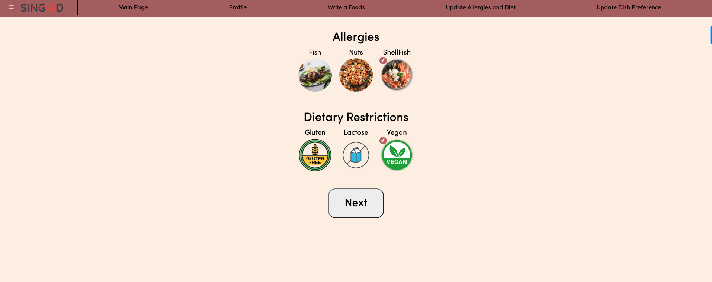
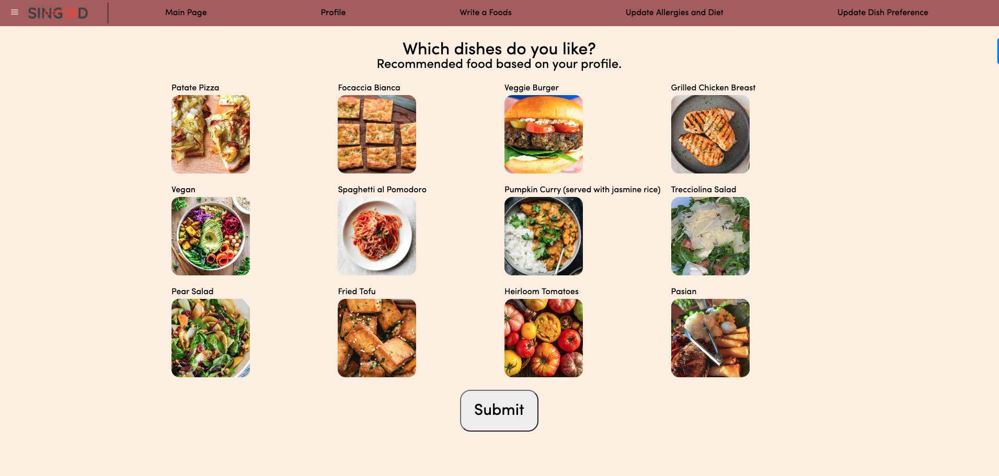
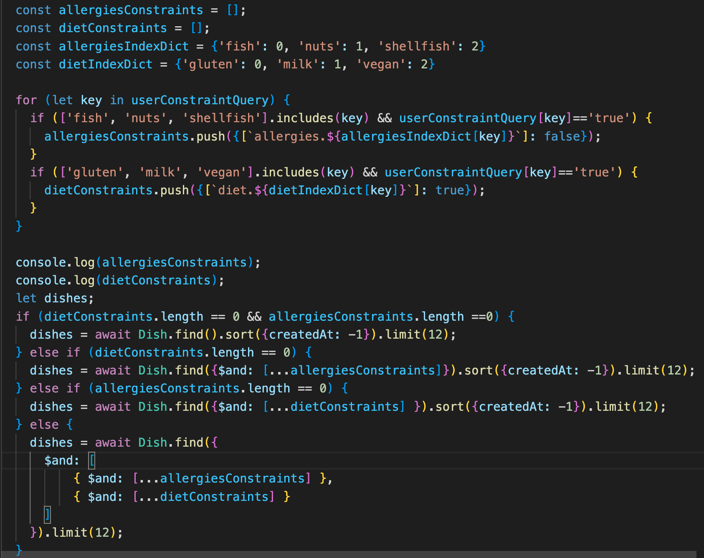
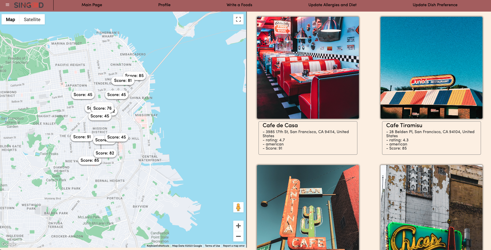
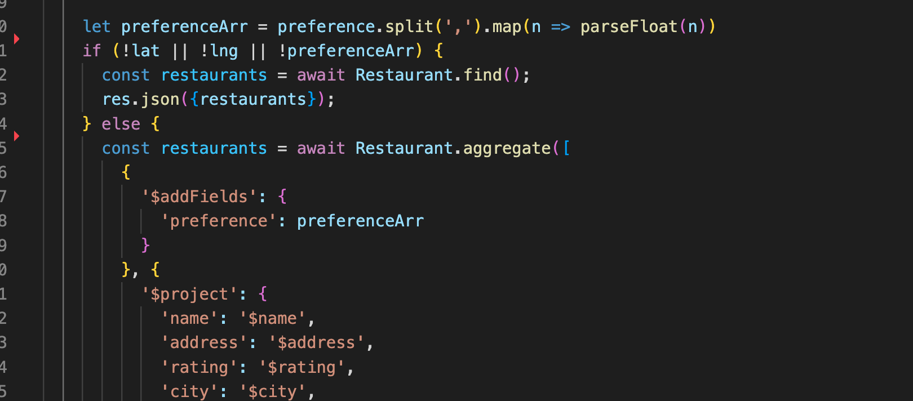
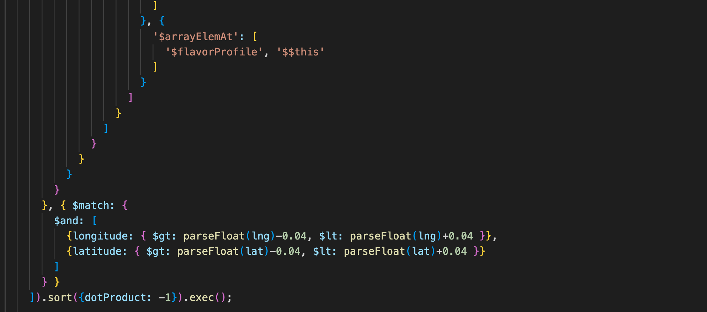

# Singed
[Live Website](https://singed-yhra.onrender.com/main)

## Background
Singed is a meal recommendation website that recommend users restaurants based on their allergies, diet, flavor profiles, and location.  
After users register, they are given a survey for their allergies, diet, and meal preferences, the backend server will generate a list of recommended restaurants. Recommendation algorithm is designed and implemented in MongoDB.  
Users can also create groups and send group messages.  

## Technology
- **React** - An frontend library for building user interfaces. It is maintained by Facebook and a community of individual developers and companies.
- **Redux** - A predictable state container for JavaScript apps.
- **Express.js**- A minimal and flexible Node.js web application framework that handles server-side rendering and integrates with Node.js.
- **MongoDB** - A document-oriented database program which is a NoSQL database program that uses JSON-like documents with optional schema.
- **Node.js** - A Node.js is a cross-platform, open-source server environment.
- **Socket.io** - An event-driven library for real-time web applications. It enables real-time, bi-directional communication between web clients and servers.  

## Features
### User Authentication - Login/Signup
Singed features a fully functional user authentication system, complete with a demo user login and error handling for incomplete entries. The login and signup pages are connected for the user easily switch between the sign up or sign in pages.  

### Allergies and Diet
After signup, Users can then choose what food they are allergic to, and also if they follow any dietary plan. They are stored in a boolean array in `models/User.js` file  

### Flavor Profile
After filling in allergies and diet, backend will filter out food they are interested in, and then generate a random list of 12 foods. Each food has its associated flavor proile. see code. 
Users can choose their favourite foods, the flavor profile will be calculated in the frontend and fetched to backend. Backend will aggregate these data and generate a flavor profile for the user. 

### Recommend Restaurants
After filling user profile, backend will calculate the cosine similarity between restaurant flavor profile and user flavor profile. The similarity is a score between 0 and 1. This score is multiplied to 100 and shown to user to indicate how likely they would like this restaurant, the restaurant is sorted in descending order.  
The cosine similarity is calculated in a convoluted MongoDB aggregation pipeline. Here is a screenshot for part of it.  
[MongoDB aggregation pipeline file](./backend/routes/api/restaurants.js)

